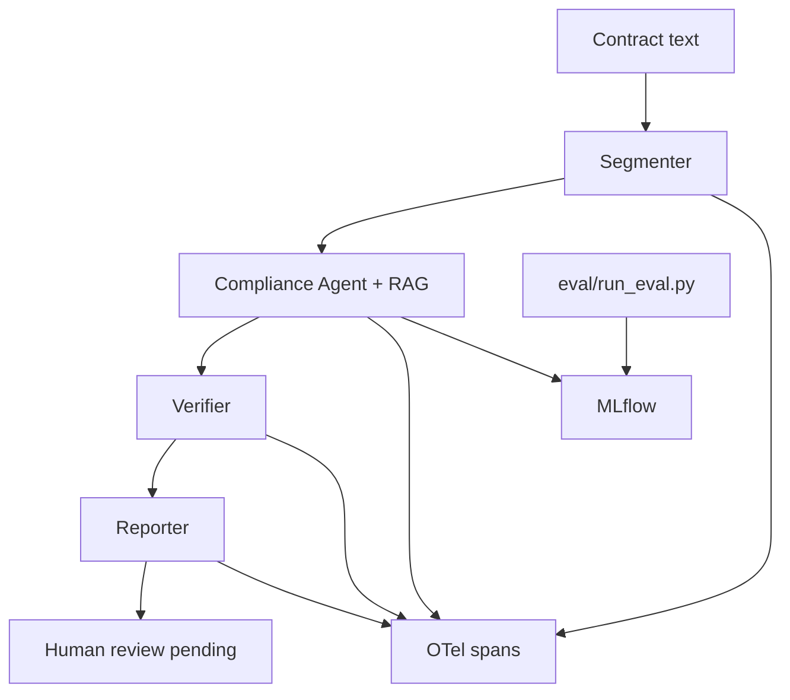

# 2-Week Plan — Contract Compliance Agents

Canonical schedule for this project. Tick checkboxes as days finish.

**Product:** First-pass vendor contract reviewer (NDA / SaaS MSA / DPA-style text).

**Checks against:** Public GDPR corpus + SOC 2–style security control summaries (not full licensed standards).

**Agents (LangGraph):** 4 agents + 1 report step.

| Agent | Job |
|-------|-----|
| **Segmenter** | Split document into clauses |
| **Compliance** | RAG + flag issues with regulation refs |
| **Verifier** | Quote must exist in clause; no invented citations |
| **Reporter** | Structured JSON + Markdown audit report |

**Human gate:** Simple approve / reject flag in output (production mindset, not a full UI).

**Observability:** MLflow (experiments + eval metrics) + OpenTelemetry (traces per agent/clause).

**Assumed pace:** ~6–8 focused hours/day. Days 13–14 are buffer.

**Cut entirely:** LEDGAR, MAUD, ContractNLI, cloud deploy, fancy UI, PDF perfection, multi-jurisdiction, running all 510 contracts on every code change.

---

## As-built notes (do not contradict these)

These are true of the repo today. Later days should follow them.

- RAG corpus is Hugging Face `AYI-NEDJIMI/gdpr-en` JSON at `data/regulations/gdpr-en/train.json`, not 10 scraped summary pages.
- SOC 2 corpus was never collected — still a later-day item.
- Store all 510 CUAD contracts (path in `config/data_paths.yaml`); **build** on 5–10; **eval** on 510 only in scheduled jobs.
- Do not put CUAD into Chroma. RAG retrieves GDPR rules from `.chroma/gdpr`.
- Chunk length follows the embedding model's `max_seq_length` (256 WordPieces for `all-MiniLM-L6-v2`), not a hardcoded 500–800 words.
- Clause segmentation is rule-based (`src/segmenter/`). Five-document store: `data/exercises/day3_segmentation/clauses.json`.
- Day 4 LangGraph skeleton: `src/graph/` + `run.py`. Linear flow with real compliance (Day 5), verifier (Day 6), and reporter (Day 7).
- Day 5 compliance agent: `src/compliance/` — RAG + OpenAI structured output; one prompt / enum `check_type`; all 5 checks per clause.
- Day 7 reporter: `src/reporter/` — `findings.json` + `audit_report.md` under `data/exercises/day7_reporter/`; human gate `pending_review` / `--auto-approve`.

---

## Architecture



---

## Week 1 — Core pipeline

### Day 1 — Foundation and data (no agents yet)

**Status: done**

- [x] Project scaffold
- [x] CUAD v1 path config (510 contracts, external)
- [x] GDPR corpus download (`scripts/download_gdpr_corpus.py`)
- [x] Manual clause exercise (`scripts/day1_manual_clause_exercise.py`)
- [x] `docs/legal_glossary.md` — core terms (clause, MSA, DPA, NDA, liability cap, subprocessor, termination, indemnification, SLA, GDPR, SOC 2, data retention)

**Shipped (not the original “10 summary pages + 5 SOC2” list):** local `gdpr-en` JSON, CUAD pointed at via config, one contract split by naive ARTICLE/Section rules into `data/exercises/day1_manual_split/clauses_manual.csv`.

**Learn (legal):** Contract = full agreement; clause = one section. MSA vs DPA vs NDA. Compliance = “does contract meet rules?” not “is contract fair?”

**Learn (tech):** Folder layout, `data/manifest.json`.

---

### Day 2 — RAG over regulations

**Status: done**

- [x] Window-aware GDPR chunker (`src/rag/chunker.py`)
- [x] Local Chroma index (`scripts/build_gdpr_index.py`, persist under `.chroma/gdpr`)
- [x] `retrieve(query, top_k)` with hit logging (`src/rag/retrieve.py`)
- [x] 5-query smoke test (`scripts/rag_smoke_test.py`)

Stack: Chroma + `sentence-transformers/all-MiniLM-L6-v2`. Chunk size is discovered from the model window, not hardcoded.

**Learn (legal):** Subprocessor = vendor’s vendor. Data retention = how long they keep your data.

**Learn (tech):** RAG metadata matters (`topic`, `source`, `type`, `article`).

**Out of scope that day (still later):** LangGraph, LLM calls, the compliance agent, SOC 2 corpus, CUAD in Chroma.

---

### Day 3 — Segmentation + clause store

**Status: done**

- [x] Ingest contract text → list of `Clause{id, text, start_hint}`
- [x] Start rule-based (headings, numbered sections); add LLM cleanup only if needed
- [x] Store in a structure later graph state can reuse: `document_id`, `clauses[]`
- [x] Run on 5 CUAD `.txt` files (not all 510)

**Learn (legal):** Liability cap — max payout if things go wrong. Indemnification — who pays if sued. Read real CUAD sections and label them in plain English.

**Learn (tech):** Clause = unit of work for all downstream agents.

**Deliverable:** `clauses.json` for 5 documents (`data/exercises/day3_segmentation/clauses.json`).

**Done when:** a script prints clauses for one contract (`python -m src.segmenter …` or `scripts/segment_contracts.py`), and you can read three of them and say what each is about — same skill as Day 1, now as reusable code (`src/segmenter/`). Plain-English labels: `data/exercises/day3_plain_english.md`.

**Shipped:** rule-based splitter (no LLM). Inputs are 5 CUAD contracts from `config/data_paths.yaml` (`cuad.contracts_txt_dir`).

**Do not:** LangGraph, LLM-as-judge, SOC 2 index, put CUAD into Chroma, full 510-contract eval.

---

### Day 4 — LangGraph skeleton and state

**Status: done**

- [x] Define `ComplianceState`: `doc`, `clauses`, `findings`, `verified_findings`, `report`, `errors`
- [x] Graph: `ingest → segment → (stub agents) → END`
- [x] Checkpointing optional; focus on linear flow first
- [x] CLI: `python run.py --contract path/to/msa.txt`

**Learn (legal):** Finding = issue + evidence quote + rule reference + severity. You are not judging law — you are producing structured allegations for review.

**Learn (tech):** LangGraph state reducers; node boundaries = one agent per node.

**Deliverable:** Pipeline runs end-to-end with empty findings.

---

### Day 5 — Compliance agent (RAG + LLM)

**Status: done (agent + wiring + synthetic bad-contract fixtures)**

- [x] For each clause: retrieve regulation chunks → LLM prompt → `Finding` list
- [x] Limit to **5 check types** (do not expand):
  1. Subprocessor / third-party sharing
  2. Data retention / deletion
  3. Breach notification timing
  4. Liability cap present/absent
  5. Termination / data return on exit
- [x] Structured output (JSON schema / Pydantic)
- [x] Deliverable exercise: 3 hand-edited “bad” contracts + answer keys under `data/exercises/day5_bad_contracts/`

**Shipped:** one shared prompt with enum `check_type`; all 5 checks on every clause; RAG queries are short (embedding window). Package `src/compliance/`; config in `config/pipeline.yaml`; CLI `--max-clauses` / `--top-k`. Offline smoke: `scripts/compliance_smoke_test.py` (mocked LLM + real Chroma, driven by bad-contract fixtures).

**Learn (legal):** Walk one clause per check type with the glossary. GDPR: personal data, processor, subprocessors (high level). SOC 2: security commitments (high level, not audit details) — only if a SOC 2 corpus exists by then.

**Learn (tech):** Prompt per check type, or one prompt with enum `check_type`.

**Deliverable:** Raw findings for synthetic “bad” contracts under `data/exercises/day5_bad_contracts/` (answer keys + offline smoke).

---

### Day 6 — Verifier agent (production mindset)

**Status: done**

- [x] Verifier rules (no ML needed for v1):
  - `evidence_quote` must be a substring of the clause (whitespace-normalized fuzzy optional)
  - `regulation_ref` must exist in the RAG corpus catalog (articles / topics / sources)
  - Drop finding if confidence is low or the quote fails
- [x] Add `verified: bool`, `reject_reason` on each finding
- [x] LangGraph: `compliance → verify → report_stub`

**Shipped:** package `src/verifier/`; config under `verifier:` in `config/pipeline.yaml`; unit tests `tests/test_verifier.py`; offline smoke `scripts/verifier_smoke_test.py`.

**Learn (legal):** Citation grounding = “show me the line” — same as citing a textbook page. This is how you evaluate without being a lawyer.

**Learn (tech):** Verifier as a gate, not another creative LLM call.

**Deliverable:** Hallucinated findings from Day 5 get auto-rejected.

---

### Day 7 — Reporter + human gate + end-to-end

**Status: done**

- [x] Reporter node: `findings.json` + `audit_report.md` (executive summary, table of findings + rejected appendix)
- [x] Human gate: `status: pending_review | approved` in output; optional `--auto-approve` for eval runs
- [x] Run full graph on 3 synthetic + 2 real templates (`scripts/day7_e2e.py`)
- [x] Fix bugs; add config for model, top_k, paths (`reporter.output_dir`)

**Shipped:** package `src/reporter/`; artifacts under `data/exercises/day7_reporter/`; offline smoke `scripts/reporter_smoke_test.py`; unit tests `tests/test_reporter.py`.

**Learn (legal):** Read your own `audit_report.md` — only ask: “does evidence match text?” Red / yellow severity: missing DPA topic = high; vague wording = medium.

**Learn (tech):** End-to-end orchestration complete.

**Deliverable (Week 1 milestone):** one command → Markdown report with citations.

---

## Week 2 — Evaluation, observability, resume polish

### Day 8 — Synthetic golden set + eval harness

- [ ] Create `data/golden/compliance_cases.jsonl` — **40–50 rows**, for example:

```json
{
  "contract_id": "synthetic_01",
  "clause_id": "c3",
  "check_type": "subprocessor",
  "expected_flag": true,
  "expected_severity": "high",
  "notes": "removed approval requirement"
}
```

- [ ] Build `eval/run_eval.py`:
  - Segmentation: clause count within tolerance vs CUAD spans (simple overlap)
  - Compliance: precision/recall on `expected_flag` per check_type
  - Verifier: % findings with valid quotes
- [ ] Baseline scores logged to console

**Learn (legal):** You author 10 synthetic cases yourself (you know ground truth). Use the assistant to help draft 30 more from templates; you verify each row.

**Learn (tech):** Golden set = contract between you and the system.

**Deliverable:** First eval numbers (even if mediocre — trend matters).

---

### Day 9 — MLflow

- [ ] Log params: `model`, `top_k`, `prompt_version`, `check_types`
- [ ] Log metrics: `precision`, `recall`, `f1`, `quote_valid_rate`, `latency_p95`
- [ ] Log artifact: `audit_report.md`, `findings.json`
- [ ] `eval/compare_runs.py` — compare prompt v1 vs v2

**Learn (tech):** MLflow for eval experiments, not model training.

**Deliverable:** 3 MLflow runs with different `top_k` or prompt tweak.

---

### Day 10 — OpenTelemetry

- [ ] Trace span per graph node + per-clause sub-spans
- [ ] Attributes: `doc_id`, `clause_id`, `agent`, `model`, `tokens`, `findings_count`
- [ ] Export to Jaeger or OTLP → console (local Docker Jaeger if easy; else console exporter)
- [ ] One trace = one contract run

**Learn (tech):** Distributed tracing for agents = debug multi-step failures.

**Deliverable:** Screenshot or saved trace showing Segment → Compliance → Verify → Report.

---

### Day 11 — CUAD subset eval + tighten agents

- [ ] CUAD overlap eval on 10 contracts: did the segmenter land text overlapping labeled spans?
- [ ] Tune segmentation only (do not chase perfect F1)
- [ ] Re-run golden eval; target modest goals:

| Metric | Realistic 2-week target |
|--------|-------------------------|
| Golden flag F1 | ≥ 0.65 |
| Quote valid rate | ≥ 0.90 |
| Segmentation overlap | ≥ 0.60 |

- [ ] Document failures in `docs/limitations.md`

**Learn (legal):** CUAD labels map to your check types (termination, liability, etc.).

**Deliverable:** MLflow run tagged `cuad_eval_v1`.

---

### Day 12 — Production hardening (small, not endless)

- [ ] Retries / timeouts on LLM calls
- [ ] Idempotent `run_id`, structured logging
- [ ] `.env` for secrets; `config.yaml` for everything else
- [ ] `tests/test_verifier.py` — quote validation unit tests
- [ ] `tests/test_golden_regression.py` — CI-friendly smoke test
- [ ] Dockerfile optional: app + Jaeger sidecar comment in README

**Learn (tech):** Production = predictable failures, config, tests — not k8s.

**Deliverable:** `pytest` green on verifier + 5 golden cases.

---

### Day 13 — Demo package and documentation

- [ ] `README.md`: problem, architecture diagram, stack, eval results, limitations
- [ ] `docs/architecture.md` — LangGraph diagram
- [ ] `docs/demo_scenarios.md` — 3 stories:
  1. Clean template → few findings
  2. Synthetic bad DPA → high-severity flags
  3. Verifier rejects hallucination (construct or replay)
- [ ] Script `demo/run_demo.sh` (or `.ps1`) — runs all 3 scenarios
- [ ] Resume bullet draft in `docs/resume.md`

**Learn:** Practice explaining the project in 2 minutes without jargon.

**Deliverable:** Repo someone can clone and run in under 30 minutes.

---

### Day 14 — Buffer, polish, optional stretch

- [ ] If behind: finish Day 8 eval + Day 9 MLflow + Day 10 OTel first
- [ ] If ahead, pick one stretch:
  - ContractNLI-style 20 quiz cases for verifier
  - Minimal FastAPI: `POST /review` returns JSON
  - Second prompt experiment logged in MLflow
- [ ] Tagged release `v0.1.0`

**Deliverable:** Project complete.

---

## Daily time budget (suggested)

| Block | Hours | Focus |
|-------|-------|--------|
| Legal reading + glossary | 0.5–1h | Only terms for that day |
| Build | 4–5h | Core deliverable |
| Eval / debug | 1–2h | Run on 1–2 contracts |
| Log learnings | 15 min | Update `docs/legal_glossary.md` |

---

## What success looks like at Day 14

You can honestly claim:

1. **Multi-agent** LangGraph pipeline with explicit state and gates
2. **RAG** over a curated regulatory corpus with metadata
3. **Evaluation** on 40–50 golden cases + CUAD subset with reported metrics
4. **Observability** — MLflow experiment tracking + OTel traces per agent
5. **Production mindset** — verifier, structured I/O, tests, config, limitations doc

You are **not** claiming lawyer-grade advice — you are claiming **engineering-grade compliance assistance**.
